# MultiHazard 

The `MultiHazard` package provides tools for stationary multivariate
statistical modeling, for example, to estimate joint occurrence
probabilities of MULTIple co-occurring HAZARDs. The package contains
functions for pre-processing data, including imputing missing values,
detrending and declustering time series as well as analyzing pairwise
correlations over a range of lags. Functionality is built in to
implement the conditional sampling - copula theory approach described in
[Jane et al. (2020)](https://doi.org/10.5194/nhess-20-2681-2020)
including the automated threshold selection method from [Solari et
al. (2017)](https://doi.org/10.1002/2016WR019426). There is a function
that calculates joint probability contours using the method of
overlaying conditional contours given in [Bender et
al. (2016)](https://doi.org/10.1080/02626667.2015.1052816) and extracts
design events such as the “most likely” event or an ensemble of possible
design events. The package also includes methods from [Murphy-Barltrop
et al. (2023)](https://doi.org/10.1002/env.2797) and [Murphy-Barltrop et
al. (2024)](https://doi.org/10.1007/s10687-024-00490-4) for deriving
isolines using the [Heffernan and Tawn
(2004)](https://doi.org/10.1111/j.1467-9868.2004.02050.x) \[HT04\]
and [Wadsworth and Tawn (2013)](https://doi.org/10.3150/12-BEJ471)
\[WT13\] models, together with a novel bootstrap procedure for
quantifying sampling uncertainty in the isolines. Three higher
dimensional approaches — standard (elliptic/Archimedean) copulas, Pair
Copula Constructions (PCCs) and a conditional threshold exceedance
approach (HT04) — are coded. Finally, the package can be implemented to
derive temporally coherent extreme events comprising a hyetograph and
water level curve for simulated peak rainfall and peak sea level events,
as outlined in (Report).

### Citation:

> Jane, R., Wahl, T., Peña, F., Obeysekera, J., Murphy-Barltrop, C.,
> Ali, J., Maduwantha, P., Li, H., and Malagón Santos, V. (under review)
> MultiHazard: Copula-based Joint Probability Analysis in R. Journal of
> Open Source Software. \[under revision\]

<br>

### Applications of package:

> Li, H., Jane, R. A., Eilander, D., Enríquez, A. R., Haer, T., and
> Ward, P. J. (2025). Assessing the spatial correlation of potential
> compound flooding in the United States, EGUsphere \[preprint\],
> <https://doi.org/10.5194/egusphere-2025-2993>.

> Amorim, R., Villarini, G., Kim, H., Jane, R., and Wahl, T. (2025). A
> Practitioner’s approach to process-driven modeling of compound
> rainfall and storm surge extremes for coastal Texas, J. Hydrol. Eng.,
> 30(5), 04025025, <https://doi.org/10.1061/JHYEFF.HEENG-648>.

> Maduwantha, P., Wahl, T., Santamaria-Aguilar, S., Jane, R., Booth, J.
> F., Kim, H., and Villarini, G. (2024). A multivariate statistical
> framework for mixed storm types in compound flood analysis, Nat.
> Hazards Earth Syst. Sci., 24, 4091–4107,
> <https://doi.org/10.5194/nhess-24-4091-2024>.

> Nasr, A. A., Wahl, T., Rashid, M. M., Jane, R., Camus, P. and Haigh,
> I. D. (2023). Temporal changes in dependence between compound coastal
> and inland flooding drivers around the contiguous United States
> coastline, Weather Clim. Extrem., 41, 100594,
> <https://doi.org/10.1016/j.wace.2023.100594>.

> Kim, H., Villarini, G., Jane, R., Wahl, T., Misra, S., and Michalek,
> A. (2023). On the generation of high‐resolution probabilistic design
> events capturing the joint occurrence of rainfall and storm surge in
> coastal basins, Int. J. Climatol, 43(2), 761-771,
> <https://doi.org/10.1002/joc.7825>.

> Kim, T., Villarini, G., Kim, H., Jane, R., and Wahl, T. (2023). On the
> compounding of nitrate loads and discharge, J. Environ. Qual., 52,
> 706–717. <https://doi.org/10.1002/jeq2.20458>.

> Peña, F., Obeysekera, J., Jane R., Nardi, F., Maran, C., Cadogan, A.,
> de Groen, F., and Melesse, A. (2023). Investigating compound flooding
> in a low elevation coastal karst environment using multivariate
> statistical and 2D hydrodynamic modeling, Weather Clim. Extrem., 39,
> 100534. <https://doi.org/10.1016/j.wace.2022.100534>.

> Jane, R., Cadavid, L., Obeysekera, J., and Wahl, T. (2020).
> Multivariate statistical modelling of the drivers of compound flood
> events in South Florida, Nat. Hazards Earth Syst. Sci., 20, 2681–2699,
> <https://doi.org/10.5194/nhess-20-2681-2020>.

<br>

## Community guidelines

Contributions to the `MultiHazard` package are welcome! Please feel free
to submit issues or pull requests on GitHub.

## Installation

Install the latest version of this package by entering the following in
R:

``` r
install.packages("remotes")
remotes::install_github("rjaneUCF/MultiHazard")
```

## 1. Introduction

The `MultiHazard` package provides tools for stationary multivariate
statistical modeling, for example, to estimate the joint distribution of
MULTIple co-occurring HAZARDs. This document is designed to explain and
demonstrate the functions contained within the package. Section 1 looks
at the functions concerned with pre-processing the data including
imputing missing values. Section 2 illustrates the functions for
detrending and declustering time series while Section 3 introduces a
function that analyzes pairwise correlations over a range of lags.
Section 4 shows how the conditional sampling - copula theory approach in
[Jane et al. (2020)](https://doi.org/10.5194/nhess-20-2681-2020) can be
implemented including the automated threshold selection method in
[Solari et al. (2017)](https://doi.org/10.1002/2016WR019426). Functions
for selecting the best fitting among an array of (non-extreme, truncated
and non-truncated) parametric marginal distributions, and copulas to
model the dependence structure are demonstrated in this section. Section
4 also contains an explanation of the function that derives the joint
probability contours according to the method of overlaying (conditional)
contours given in [Bender et
al. (2016)](https://doi.org/10.1080/02626667.2015.1052816), and extracts
design events such as the “most likely” event or an ensemble of possible
design events. Section 4 also introduces the functions that generate
isolines using the methods from [Murphy-Barltrop et
al. (2023)](https://doi.org/10.1002/env.2797) and [Murphy-Barltrop et
al. (2024)](https://doi.org/10.1007/s10687-024-00490-4), and implements
a novel bootstrap procedure for quantifying sampling uncertainty in the
isolines. Section 5 introduces the functions for fitting and simulating
synthetic events from three higher-dimensional approaches - standard
(elliptic/Archimedean) copulas, Pair Copula Constructions (PCCs) and the
conditional threshold exceedance approach of HT04. Section 6 describes a
function that calculates the time for a user-specified height of sea
level rise to occur under various scenarios. Lastly, Section 7 shows the
simulation of temporally coherent extreme rainfall and ocean water level
events.

## 2. Pre-processing

### Imputation

Well G_3356 represents the groundwater level at Site S20, however, it
contains missing values. Let’s impute missing values in the record at
Well G_3356 using recordings at nearby Well G_3355. First, reading in
the two time series.

``` r
#Viewing first few rows of in the groundwater level records
head(G_3356)
```

    ##         Date Value
    ## 1 1985-10-23  2.46
    ## 2 1985-10-24  2.47
    ## 3 1985-10-25  2.41
    ## 4 1985-10-26  2.37
    ## 5 1985-10-27  2.63
    ## 6 1985-10-28  2.54

``` r
head(G_3355)
```

    ##         Date Value
    ## 1 1985-08-20  2.53
    ## 2 1985-08-21  2.50
    ## 3 1985-08-22  2.46
    ## 4 1985-08-23  2.43
    ## 5 1985-08-24  2.40
    ## 6 1985-08-25  2.37

``` r
#Converting Date column to "Date"" object
G_3356$Date<-seq(as.Date("1985-10-23"), as.Date("2019-05-29"), by="day")
G_3355$Date<-seq(as.Date("1985-08-20"), as.Date("2019-06-02"), by="day")
#Converting column containing the readings to a "numeric"" object
G_3356$Value<-as.numeric(as.character(G_3356$Value))
G_3355$Value<-as.numeric(as.character(G_3355$Value))
```

Warning message confirms there are NAs in the record at Well G_3356.
Before carrying out the imputation the two data frames need to be
merged.

``` r
#Merge the two dataframes by date
GW_S20<-left_join(G_3356,G_3355,by="Date")
colnames(GW_S20)<-c("Date","G3356","G3355")
#Carrying out imputation
Imp<-Imputation(Data=GW_S20,Variable="G3356",
                x_lab="G-3355 (ft NGVD 29)", y_lab="G-3356 (ft NGVD 29)")
```

<!-- -->

The completed record is given in the `ValuesFilled` column of the data
frame outputted as the `Data` object while the linear regression model
including its coefficient of determinant are given by the `model` output
argument.

``` r
head(Imp$Data)
```

    ##         Date G3356 G3355 ValuesFilled
    ## 1 1985-10-23  2.46  2.87         2.46
    ## 2 1985-10-24  2.47  2.85         2.47
    ## 3 1985-10-25  2.41  2.82         2.41
    ## 4 1985-10-26  2.37  2.79         2.37
    ## 5 1985-10-27  2.63  2.96         2.63
    ## 6 1985-10-28  2.54  2.96         2.54

``` r
Imp$Model
```

    ## 
    ## Call:
    ## lm(formula = data[, variable] ~ data[, Other.variable])
    ## 
    ## Residuals:
    ##      Min       1Q   Median       3Q      Max 
    ## -1.60190 -0.16654  0.00525  0.16858  1.73824 
    ## 
    ## Coefficients:
    ##                        Estimate Std. Error t value Pr(>|t|)    
    ## (Intercept)            0.275858   0.012366   22.31   <2e-16 ***
    ## data[, Other.variable] 0.700724   0.004459  157.15   <2e-16 ***
    ## ---
    ## Signif. codes:  0 '***' 0.001 '**' 0.01 '*' 0.05 '.' 0.1 ' ' 1
    ## 
    ## Residual standard error: 0.2995 on 11825 degrees of freedom
    ##   (445 observations deleted due to missingness)
    ## Multiple R-squared:  0.6762, Adjusted R-squared:  0.6762 
    ## F-statistic: 2.47e+04 on 1 and 11825 DF,  p-value: < 2.2e-16

Are any values still NA?

``` r
G_3356_ValueFilled_NA<-which(is.na(Imp$Data$ValuesFilled)==TRUE)
length(G_3356_ValueFilled_NA) 
```

    ## [1] 3

Linear interpolating the three remaining NAs.

``` r
G3356_approx<-approx(seq(1,length(Imp$Data$ValuesFilled),1),Imp$Data$ValuesFilled,
                     xout=seq(1,length(Imp$Data$ValuesFilled),1))
Imp$Data$ValuesFilled[which(is.na(Imp$Data$ValuesFilled)==TRUE)]<-
  G3356_approx$y[which(is.na(Imp$Data$ValuesFilled)==TRUE)]
```

### Detrending

In the analysis completed O-sWL (Ocean-side Water Level) and groundwater
level series are subsequently detrended. The Detrend() function uses
either a linear fit covering the entire data (`Method`=`linear`) or
moving average window (`Method`=`window`) of a specified length
(`Window_Width`) to remove trends from a time series. The residuals are
added to the final `End_Length` observations. The default `Detrend()`
parameters specify a moving average (`Method`=`window`) three month
window (`Window_Width`=`89`), to remove any seasonality from the time
series. The default is then to add the residuals to the average of the
final five years of observations (`End_Length`=`1826`) to bring the
record to the present day level, accounting for the Perigean tide in the
case of O-sWL. The mean of the observations over the first three months
were subtracted from the values during this period before the present
day (5-year) average was added. The following R code detrends the record
at Well G_3356. Note the function requires a Date object and the
completed series.

``` r
#Creating a data frame with the imputed series alongside the corresponding dates 
G_3356_Imp<-data.frame(Imp$Data$Date,Imp$Data$ValuesFilled)
colnames(G_3356_Imp)<-c("Date","ValuesFilled")
#Detrending
G_3356_Detrend<-Detrend(Data=G_3356_Imp,PLOT=TRUE,x_lab="Date",
                        y_lab="Groundwater level (ft NGVD 29)")
```

<!-- -->

Output of the function is simply the detrended time series.

``` r
head(G_3356_Detrend)
```

    ## [1] 2.394700 2.411588 2.360033 2.327588 2.595588 2.520255

Creating a data frame containing the detrended groundwater series at
site S_20 i.e. G_3356_Detrend and their corresponding dates

``` r
S20.Groundwater.Detrend.df<-data.frame(as.Date(GW_S20$Date),G_3356_Detrend)
colnames(S20.Groundwater.Detrend.df)<-c("Date","Groundwater")
```

### Declustering

The `Decluster()` function declusters a time series using a threshold u
specified as a quantile of the completed series and separation criterion
`SepCrit` to ensure independent events. If `mu`=`365.25` then `SepCrit`
denotes the minimum number of days readings must remain below the
threshold before a new event is defined.

``` r
G_3356.Declustered<-Decluster(Data=G_3356_Detrend,u=0.95,SepCrit=3,mu=365.25)
```

Plot showing the completed, detrended record at Well G-3356 (grey
circles) along with cluster maxima (red circles) identified using a 95%
threshold (green line) and three day separation criterion.

``` r
G_3356_Imp$Detrend<-G_3356_Detrend
plot(as.Date(G_3356_Imp$Date),G_3356_Imp$Detrend,col="Grey",pch=16,
     cex=0.25,xlab="Date",ylab="Groundwater level (ft NGVD 29)")
abline(h=G_3356.Declustered$Threshold,col="Dark Green")
points(as.Date(G_3356_Imp$Date[G_3356.Declustered$EventsMax]),
       G_3356.Declustered$Declustered[G_3356.Declustered$EventsMax],
       col="Red",pch=16,cex=0.5)
```

<!-- -->

Other outputs from the `Decluster()` function include the threshold on
the original scale

``` r
G_3356.Declustered$Threshold
```

    ## [1] 2.751744

and the number of events per year

``` r
G_3356.Declustered$Rate
```

    ## [1] 7.857399

In preparation for later work, lets assign the detrended and declustered
groundwater series at site S20 a name.

``` r
S20.Groundwater.Detrend.Declustered<-G_3356.Declustered$Declustered
```

Reading in the other rainfall and O-sWL series at Site S20

``` r
#Changing names of the data frames
S20.Rainfall.df<-Perrine_df
S20.OsWL.df<-S20_T_MAX_Daily_Completed_Detrend_Declustered[,c(2,4)]
#Converting Date column to "Date"" object
S20.Rainfall.df$Date<-as.Date(S20.Rainfall.df$Date)
S20.OsWL.df$Date<-as.Date(S20.OsWL.df$Date)
```

Detrending and declustering the rainfall and O-sWL series at Site S20

``` r
S20.OsWL.Detrend<-Detrend(Data=S20.OsWL.df,Method = "window",PLOT=FALSE,
                          x_lab="Date",y_lab="O-sWL (ft NGVD 29)")
```

Creating a dataframe with the date alongside the detrended OsWL series

``` r
S20.OsWL.Detrend.df<-data.frame(as.Date(S20.OsWL.df$Date),S20.OsWL.Detrend)
colnames(S20.OsWL.Detrend.df)<-c("Date","OsWL")
```

Declustering rainfall and O-sWL series at site S20,

``` r
#Declustering rainfall and O-sWL series
S20.Rainfall.Declustered<-Decluster(Data=S20.Rainfall.df$Value,u=0.95,SepCrit=3)$Declustered
S20.OsWL.Detrend.Declustered<-Decluster(Data=S20.OsWL.Detrend,u=0.95,SepCrit=3,mu=365.25)$Declustered
```

Creating data frames with the date alongside declustered series

``` r
S20.OsWL.Detrend.Declustered.df<-data.frame(S20.OsWL.df$Date,S20.OsWL.Detrend.Declustered)
colnames(S20.OsWL.Detrend.Declustered.df)<-c("Date","OsWL")
S20.Rainfall.Declustered.df<-data.frame(S20.Rainfall.df$Date,S20.Rainfall.Declustered)
colnames(S20.Rainfall.Declustered.df)<-c("Date","Rainfall")
S20.Groundwater.Detrend.Declustered.df<-data.frame(G_3356$Date,S20.Groundwater.Detrend.Declustered)
colnames(S20.Groundwater.Detrend.Declustered.df)<-c("Date","Groundwater")
```

Use the `Dataframe_Combine()` function to create data frames containing
all observations of the original, detrended if necessary, and
declustered time series. On dates where not all variables are observed,
missing values are assigned NA.

``` r
S20.Detrend.df<-Dataframe_Combine(data.1<-S20.Rainfall.df,
                                  data.2<-S20.OsWL.Detrend.df,
                                  data.3<-S20.Groundwater.Detrend.df,
                                  names=c("Rainfall","OsWL","Groundwater"))
S20.Detrend.Declustered.df<-Dataframe_Combine(data.1<-S20.Rainfall.Declustered.df,
                                              data.2<-S20.OsWL.Detrend.Declustered.df,
                                              data.3<-S20.Groundwater.Detrend.Declustered.df,
                                              names=c("Rainfall","OsWL","Groundwater"))
```

The package contains two other declustering functions. The
`Decluster_SW()` function declusters a time series via a storm window
approach. A moving window of length (`Window_Width`) is moved over the
time series, if the maximum value is located at the center of the window
then the value is considered a peak and retained, otherwise it is set
equal to NA. For a seven day window at S20:

``` r
S20.Rainfall.Declustered.SW<-Decluster_SW(Data=S20.Rainfall.df,Window_Width=7)
```

Plotting the original and detrended series:

``` r
plot(S20.Rainfall.df$Date,S20.Rainfall.df$Value,pch=16,cex=0.5,
     xlab="Date",ylab="Total daily rainfall (Inches)")
points(S20.Rainfall.df$Date,S20.Rainfall.Declustered.SW$Declustered,pch=16,col=2,cex=0.5)
```

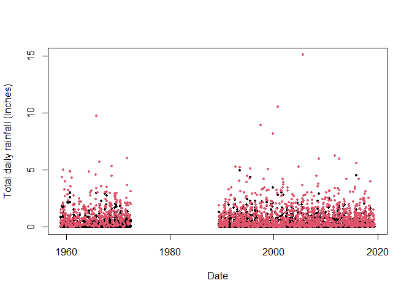<!-- -->

Repeating the analysis for the O-sWL with a 3-day window.

``` r
S20.OsWL.Declustered.SW<-Decluster_SW(Data=S20.OsWL.df,Window_Width=3)
```

The `Decluster_S_SW()` function declusters a summed time series via a
storm window approach. First a moving window of width
(`Window_Width_Sum`) travels across the data and each time the values
are summed. As with the `Decluster_SW()` function a moving window of
length `(Window_Width`) is then moved over the time series, if the
maximum value in a window is located at its center then the value
considered a peak and retained, otherwise it is set equal to NA. To
decluster weekly precipitation totals using a seven day storm window at
S20:

``` r
#Declustering
S20.Rainfall.Declustered.S.SW<-Decluster_S_SW(Data=S20.Rainfall.df, 
                                              Window_Width_Sum=7, Window_Width=7)
#First twenty values of the weekly totals
S20.Rainfall.Declustered.S.SW$Totals[1:20]
```

    ##  [1]   NA   NA   NA 0.23 0.19 0.10 1.56 1.94 2.04 2.04 2.04 2.91 3.02 2.75 3.15
    ## [16] 3.05 3.05 3.05 2.18 2.03

``` r
#First ten values of the declustered weekly totals
S20.Rainfall.Declustered.S.SW$Declustered[1:20]
```

    ##  [1]   NA   NA   NA   NA   NA   NA   NA   NA   NA   NA   NA   NA   NA   NA 3.15
    ## [16]   NA   NA   NA   NA   NA

Plotting the original and detrended series:

``` r
plot(S20.Rainfall.df$Date,S20.Rainfall.Declustered.S.SW$Totals,pch=16,cex=0.5,
     xlab="Date",ylab="Total weekly rainfall (Inches)")
points(S20.Rainfall.df$Date,S20.Rainfall.Declustered.S.SW$Declustered,pch=16,col=2,cex=0.5)
```

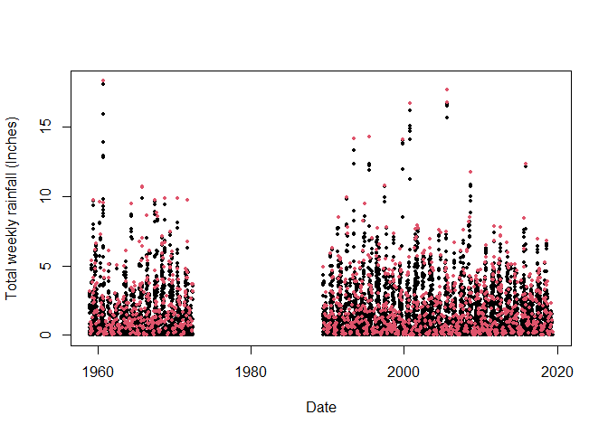<!-- -->

#### Fit GPD

The `GPD_Fit()` function fits a generalized Pareto distribution (GPD) to
observations above a threshold u, specified as a quantile of the
completed time series. To fit the distribution the `GPD_Fit()` function
requires the declustered series as its Data argument and the entire
completed series, detrended if necessary, as its `Data_Full` argument.
The completed series is required to calculate the value on the original
scale corresponding to u. If `PLOT=TRUE` then diagnostic plots are
produced to allow an assessment of the fit.

``` r
GPD_Fit(Data=S20.Detrend.Declustered.df$Rainfall,Data_Full=na.omit(S20.Detrend.df$Rainfall),
        u=0.997,PLOT=TRUE,xlab_hist="Rainfall (Inches)",y_lab="Rainfall (Inches)")
```

<!-- -->

    ## $Threshold
    ## [1] 3.5465
    ## 
    ## $Rate
    ## [1] 1.021938
    ## 
    ## $sigma
    ## [1] 1.421037
    ## 
    ## $xi
    ## [1] 0.1696554
    ## 
    ## $sigma.SE
    ## [1] 0.2365755
    ## 
    ## $xi.SE
    ## [1] 0.1781031

#### Solari (2017) automated threshold selection

[Solari et al. (2017)](https://doi.org/10.1002/2016WR019426) proposes a
methodology for automatic threshold estimation, based on an
EDF-statistic and a goodness of fit test to test the null hypothesis
that exceedances of a high threshold come from a GPD distribution.

EDF-statistics measure the distance between the empirical distribution

obtained from the sample and the parametric distribution
").
The Anderson Darling

statistic is an EDF-statistic, which assigns more weight to the tails of
the data than similar measures. [Sinclair et
al. (1990)](https://doi.org/10.1080/03610929008830405) proposed the
right-tail weighted Anderson Darling statistic

which allocates more weight to the upper tail and less to the lower tail
of the distribution than

and is given by:

}{n}\right)\text{log}(1-z\_{i})+2z\_{i}\right\]")

where
")
and

is the sample size. The approach in [Solari et
al. (2017)](https://doi.org/10.1002/2016WR019426) is implemented as
follows:

1.  A time series is declustered using the storm window approach to
    identify independent peaks.
2.  Candidate thresholds are defined by ordering the peaks and removing
    any repeated values. A GPD is fit to all the peaks above each
    candidate threshold. The right-tail weighted Anderson-Darling
    statistic
    
    and its corresponding p-value are calculated for each threshold.
3.  The threshold that minimizes one minus the p-value is then selected.

The `GPD_Threshold_Solari()` function carries out these steps.

``` r
S20.Rainfall.Solari<-GPD_Threshold_Solari(Event=S20.Rainfall.Declustered.SW$Declustered,
                                          Data=S20.Detrend.df$Rainfall)
```

<!-- -->

The optimum threshold according to the Solari approach is

``` r
S20.Rainfall.Solari$Candidate_Thres
```

    ## [1] 2.6

``` r
Rainfall.Thres.Quantile<-ecdf(S20.Detrend.df$Rainfall)(S20.Rainfall.Solari$Candidate_Thres)
```

The `GPD_Threshold_Solari_Sel()` allows the goodness-of-fit at a
particular threshold (`Thres`) to be investigated in more detail. Let’s
study the fit of the threshold selected by the method.

``` r
Solari.Sel<-GPD_Threshold_Solari_Sel(Event=S20.Rainfall.Declustered.SW$Declustered,
                                    Data=S20.Detrend.df$Rainfall,
                                    Solari_Output=S20.Rainfall.Solari,
                                    Thres=S20.Rainfall.Solari$Candidate_Thres,
                                    RP_Max=100)
```

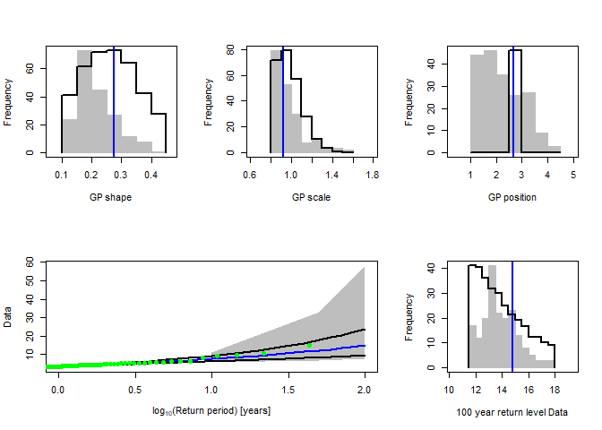<!-- -->

Repeating the automated threshold selection procedure for O-sWL.

``` r
S20.OsWL.Solari<-GPD_Threshold_Solari(Event=S20.OsWL.Declustered.SW$Declustered,
                                      Data=S20.Detrend.df$OsWL)
```

<!-- -->

``` r
S20.OsWL.Solari$Candidate_Thres
```

    ## [1] 2.032

``` r
OsWL.Thres.Quantile<-ecdf(S20.Detrend.df$OsWL)(S20.OsWL.Solari$Candidate_Thres)
```

and checking the fit of the GPD at the selected threshold.

``` r
Solari.Sel<-GPD_Threshold_Solari_Sel(Event=S20.OsWL.Declustered.SW$Declustered,
                                     Data=S20.Detrend.df$OsWL,
                                     Solari_Output=S20.OsWL.Solari,
                                     Thres=S20.OsWL.Solari$Candidate_Thres,
                                     RP_Max=100)
```

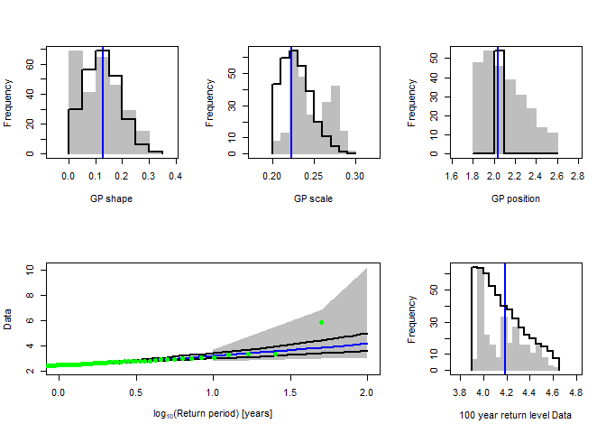<!-- -->

## 3. Correlation analysis

We can use the `Kendall_Lag()` function to view the Kendall’s rank
correlations coefficient

between the time series over a range of lags

``` r
S20.Kendall.Results<-Kendall_Lag(Data=S20.Detrend.df,GAP=0.2)
```

<!-- -->

Let’s pull out the Kendall correlation coefficient values between
rainfall and O-sWL for lags of

applied to the latter quantity

``` r
S20.Kendall.Results$Value$Rainfall_OsWL
```

    ##  [1]  0.046483308  0.051860955  0.051392298  0.051311970  0.054097316
    ##  [6]  0.058316831  0.061388245  0.035305812  0.004206059 -0.014356749
    ## [11] -0.025993095 -0.030431776 -0.029481162

and the corresponding p-values testing the null hypothesis


``` r
S20.Kendall.Results$Test$Rainfall_OsWL_Test
```

    ##  [1] 5.819748e-13 1.014698e-15 8.196547e-16 1.030482e-15 5.160274e-17
    ##  [6] 1.887733e-19 1.987221e-20 2.232548e-07 4.033739e-01 7.669577e-02
    ## [11] 1.186248e-03 6.352872e-05 3.864403e-05

## 4. Bivariate Analysis

#### Two-sided conditional sampling - copula theory method

In the report the 2D analysis considers the two forcings currently
accounted for in structural design assessments undertaken by SFWMD:
rainfall and O-sWL. The 2D analysis commences with the well-established
two-sided conditional sampling approach, where excesses of a
conditioning variable are paired with co-occurring values of another
variable to create two samples. For each sample the marginals (one
extreme, one non-extreme) and joint distribution are then modeled.

The two (conditional) joint distributions are modeled independently of
the marginals by using a copula. The `Copula_Threshold_2D()` function
explores the sensitivity of the best fitting copula, in terms of Akaike
Information Criterion (AIC), to allow the practitioner to make an
informed choice with regards to threshold selection. It undertakes the
conditional sampling described above and reports the best fitting
bivariate copula. The procedure is carried out for a single or range of
thresholds specified by the `u` argument and the procedure is
automatically repeated with the variables switched.

``` r
Copula_Threshold_2D(Data_Detrend=S20.Detrend.df[,-c(1,4)],
Data_Declust=S20.Detrend.Declustered.df[,-c(1,4)],
y_lim_min=-0.075, y_lim_max =0.25,
Upper=c(2,9), Lower=c(2,10),GAP=0.15)
```

<!-- -->

    ## $Kendalls_Tau1
    ##  [1] 0.05627631 0.05803451 0.05900376 0.08072261 0.10731477 0.14151449
    ##  [7] 0.14427232 0.14762199 0.13101587 0.05056147
    ## 
    ## $p_value_Var1
    ##  [1] 7.698074e-03 9.251524e-03 1.424015e-02 1.974145e-03 1.559739e-04
    ##  [6] 1.171141e-05 4.256557e-05 2.055448e-04 6.000832e-03 4.413023e-01
    ## 
    ## $N_Var1
    ##  [1] 1008  904  776  661  559  432  363  286  200  107
    ## 
    ## $Copula_Family_Var1
    ##  [1]  6  6  6  6  6  6  6 13  6  6
    ## 
    ## $Kendalls_Tau2
    ##  [1] 0.1113049 0.1359921 0.1377104 0.1561184 0.1579352 0.1359861 0.1183870
    ##  [8] 0.1463056 0.1482198 0.1904729
    ## 
    ## $p_value_Var2
    ##  [1] 2.720713e-05 2.549673e-06 1.199322e-05 1.143046e-05 1.879301e-04
    ##  [6] 1.335664e-02 5.199742e-02 3.145804e-02 6.891926e-02 8.220838e-02
    ## 
    ## $N_Var2
    ##  [1] 760 639 535 416 290 168 136 110  77  43
    ## 
    ## $Copula_Family_Var2
    ##  [1]   6   6   6   6 204 204 204 204   1 204

The `Diag_Non_Con()` function is designed to aid in the selection of the
appropriate (non-extreme) unbounded marginal distribution for the
non-conditioned variable.

``` r
S20.Rainfall<-Con_Sampling_2D(Data_Detrend=S20.Detrend.df[,-c(1,4)],
Data_Declust=S20.Detrend.Declustered.df[,-c(1,4)],
Con_Variable="Rainfall",u = Rainfall.Thres.Quantile)
Diag_Non_Con(Data=S20.Rainfall$Data$OsWL,Omit=c("Gum","RGum"),x_lab="O-sWL (ft NGVD 29)",y_lim_min=0,y_lim_max=1.5)
```

<!-- -->

    ## $AIC
    ##   Distribution      AIC
    ## 1         Gaus 81.27871
    ## 2          Gum       NA
    ## 3         Lapl 92.82204
    ## 4        Logis 84.19031
    ## 5         RGum       NA
    ## 
    ## $Best_fit
    ## [1] "Gaus"

The `Diag_Non_Con_Sel()` function, is similar to the `Diag_Non_Con()`
command, but only plots the probability density function and cumulative
distribution function of a (single) selected univariate distribution in
order to more clearly demonstrate the goodness of fit of a particular
distribution. The options are the Gaussian (`Gaus`), Gumbel (`Gum`),
Laplace (`Lapl`), logistic (`Logis`) and reverse Gumbel (`RGum`)
distributions.

``` r
Diag_Non_Con_Sel(Data=S20.Rainfall$Data$OsWL,x_lab="O-sWL (ft NGVD 29)",
y_lim_min=0,y_lim_max=1.5,Selected="Logis")
```

<!-- -->

A generalized Pareto distribution is fitted to the marginal distribution
of the conditioning variable i.e. the declustered excesses identified
using `Con_Sampling_2D()`.

The process of selecting a conditional sample and fitting marginal
distributions is repeated but instead conditioning on O-sWL. The
non-conditional variable in this case is (total daily) rainfall, which
has a lower bound at zero, and thus requires a suitably truncated
distribution. The `Diag_Non_Con_Trunc` fits a selection of truncated
distributions to a vector of data. The `Diag_Non_Con_Sel_Trunc` function
is analogous to the `Diag_Non_Con_Sel` function, available distributions
are the Birnbaum-Saunders (`BS`), exponential (`Exp`), gamma (`Gam(2)`),
inverse Gaussian (`InvG`), lognormal (`LogN`), Tweedie (`Twe`) and
Weibull (`Weib`). If the gamlss and gamlss.mx packages are loaded then
the three-parameter gamma (`Gam(3)`), two-parameter mixed gamma
(`GamMix(2)`) and three-parameter mixed gamma (`GamMix(3)`)
distributions are also tested.

``` r
S20.OsWL<-Con_Sampling_2D(Data_Detrend=S20.Detrend.df[,-c(1,4)],
Data_Declust=S20.Detrend.Declustered.df[,-c(1,4)],
Con_Variable="OsWL",u=OsWL.Thres.Quantile)
S20.OsWL$Data$Rainfall<-S20.OsWL$Data$Rainfall+runif(length(S20.OsWL$Data$Rainfall),0.001,0.01)
Diag_Non_Con_Trunc(Data=S20.OsWL$Data$Rainfall+0.001,x_lab="Rainfall (Inches)",
y_lim_min=0,y_lim_max=2)
```

<!-- -->

    ## $AIC
    ##   Distribution        AIC
    ## 1           BS  -1.101477
    ## 2          Exp 109.040920
    ## 3       Gam(2)  29.018041
    ## 4       Gam(3)  29.579131
    ## 5        LNorm  24.791601
    ## 6        TNorm 216.419285
    ## 7          Twe  23.887266
    ## 8         Weib  27.136046
    ## 
    ## $Best_fit
    ## [1] "BS"

``` r
Diag_Non_Con_Trunc_Sel(Data=S20.OsWL$Data$Rainfall+0.001,x_lab="Rainfall (Inches)",
y_lim_min=0,y_lim_max=2,
Selected="BS")
```

<!-- -->

The `Design_Event_2D()` function finds the isoline associated with a
particular return period, by overlaying the two corresponding isolines
from the joint distributions fitted to the conditional samples using the
method in Bender et al. (2016). `Design_Event_2D()` requires the copulas
families chosen to model the dependence structure in the two conditional
samples as input.

``` r
S20.Copula.Rainfall<-Copula_Threshold_2D(Data_Detrend=S20.Detrend.df[,-c(1,4)],
Data_Declust=S20.Detrend.Declustered.df[,-c(1,4)],
u1=Rainfall.Thres.Quantile,u2=NA,
y_lim_min=0,y_lim_max=0.25, GAP=0.075)$Copula_Family_Var1
```

<!-- -->

``` r
S20.Copula.OsWL<-Copula_Threshold_2D(Data_Detrend=S20.Detrend.df[,-c(1,4)],
Data_Declust=S20.Detrend.Declustered.df[,-c(1,4)],
u1=NA,u2=OsWL.Thres.Quantile,
y_lim_min=0,y_lim_max=0.25,GAP=0.075)$Copula_Family_Var2
```

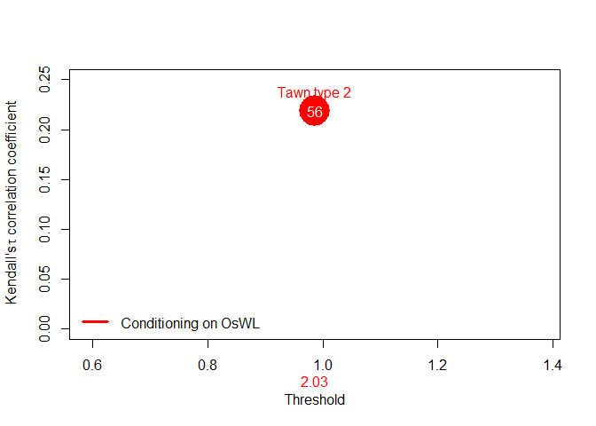<!-- -->

As input the function requires

- `Data` = Original (detrended) rainfall and O-sWL series
- `Data_Con1`/`Data_Con2` = two conditionally sampled data sets,
- `u1`/`u2` or `Thres1`/`Thres2` = two thresholds associated with the
  conditionally sampled data sets
- `Copula_Family1`/`Copula_Family2` two families of the two fitted
  copulas
- `Marginal_Dist1`/`Marginal_Dist2`Selected non-extreme marginal
  distributions
- `RP` = Return Period of interest
- `N` = size of the sample from the fitted joint distributions used to
  estimate the density along the isoline of interest
- `N_Ensemble` = size of the ensemble of events sampled along the
  isoline of interest

``` r
S20.Bivariate<-Design_Event_2D(Data=S20.Detrend.df[,-c(1,4)], 
Data_Con1=S20.Rainfall$Data, 
Data_Con2=S20.OsWL$Data, 
u1=Rainfall.Thres.Quantile, 
u2=OsWL.Thres.Quantile, 
Copula_Family1=S20.Copula.Rainfall,
Copula_Family2=S20.Copula.OsWL, 
Marginal_Dist1="Logis", Marginal_Dist2="BS",
x_lab="Rainfall (Inches)",y_lab="O-sWL (ft NGVD 29)",
RP=100,N=10^7,N_Ensemble=10)
```

<!-- -->

Design event according to the “Most likely” event approach (diamond in
the plot)

``` r
S20.Bivariate$MostLikelyEvent$`100`
```

    ##   Rainfall     OsWL
    ## 1 0.180042 3.174497

Design event under the assumption of full dependence (triangle in the
plot)

``` r
S20.Bivariate$FullDependence$`100`
```

    ##   Rainfall OsWL
    ## 1    14.56 3.31

#### Cooley (2019) projection method

[Cooley et al. (2019)](https://doi.org/10.1007/s10687-019-00348-0) puts
forward a non-parametric approach for constructing the isoline
associated with exceedance probability
.
The approach centers around constructing a base isoline with a larger
exceedance probability

and projecting it to more extreme levels.

should be small enough to be representative of the extremal dependence
but large enough for sufficient data to be involved in the estimation
procedure.

The approach begins by approximating the joint survival function via a
kernel density estimator from which the base isoline is derived. For the
marginal distributions, a GPD is fit above a sufficiently high threshold
to allow extrapolation into the tails and the empirical distribution is
used below the threshold. Unless the joint distribution of the two
variables is regularly varying, a marginal transformation is required
for the projection. The two marginals are thus transformed to Frechet
scales. For asymptotic dependence, on the transformed scale the isoline
with exceedance probability

can be obtained as
=s^{−1}l_T(p_{base})")
where
.
For the case of asymptotic independence,
=s^{\frac{1}{\eta}}l_{T}(p_{base})"),
where

is the tail dependence coefficient. Applying the inverse Frechet
transformation gives the isoline on the original scale.

Let’s estimate the 100-year (p=0.01) rainfall-OsWL isoline at S20 using
the 10-year isoline as the base isoline.

``` r
#Fitting the marginal distribution
#See next section for information on the Migpd_Fit function
S20.GPD<-Migpd_Fit(Data=S20.Detrend.Declustered.df[,2:3], Data_Full = S20.Detrend.df[,2:3], 
                   mqu =c(0.99,0.99))
#10-year exceedance probability for daily data
p.10<-(1/365.25)/10
#10-year exceedance probability for daily data
p.100<-(1/365.25)/100
#Calculating the isoline
isoline<-Cooley19(Data=na.omit(S20.Detrend.df[,2:3]),Migpd=S20.GPD,
                  p.base=p.10,p.proj=p.100,PLOT=TRUE,x_lim_max_T=15000,y_lim_max_T=15000)
```

<!-- -->

#### Radial-based isolines

When the dependence structure between two variables differs
significantly across conditional samples — as captured by their
respective copulas — it can produce an inflection point in certain
regions of the probability space when overlaying the partial isolines.
While these effects are mathematically sound, they represent
methodological artifacts rather than natural phenomena, potentially
limiting the physical interpretability of results in these regions of
the joint distribution. [Murphy-Barltrop et
al. (2023)](https://doi.org/10.1002/env.2797) proposed new estimation
methods for bivariate isolines that avoid fitting copulas while
accounting for both asymptotic independence (AI) and asymptotic
dependence (AD). Their techniques exploit existing bivariate extreme
value models — specifically the [Heffernan and Tawn
(2004)](https://doi.org/10.1111/j.1467-9868.2004.02050.x) [HT04](#ht04)
and [Wadsworth and Tawn (2013)](https://doi.org/10.3150/12-BEJ471)
\[WT13\] approaches. An additional benefit of these new approaches is
that it is possible to derive confidence intervals that account for the
sampling uncertainty.

When employing the HT04 model to construct the isoline with exceedance
probability
,
the first step is to convert the variables
")
to the Laplace scale
").
The HT04 model is a conditional exceedance model and is therefore fit
twice, conditioning on both

and

separately, thus allowing us to estimate the curve in different regions.
In particular, we consider the regions defined by

where

and

where \$ y\_{L} x\_{L}\$. For region
,
we start by selecting a high threshold

such that
>p")
and fit the HT04 model to observations where
.
Next, a decreasing series of thresholds is defined in the interval
)")
where

is the minimal quantile for which the fitted model is valid and
")
is the limit that values can attain on this curve. For a given quantile
in the interval
,
use the model to simulate from the conditional distribution

and estimate

the
")th
quantile. Since
")
and

 = P(X_L>x* | Y_L>y*)P(Y_L>y*) = p/q \times q = p")

, the point
")
lies on the isoline. The process is repeated until a value

where

is obtained or we exhaust all values in the interval. A very similar
procedure is implemented for region
,
this time selecting
,
a high quantile of

for quantiles in the interval
)")
where
")
if it exists and

otherwise.

The WT13 model is defined in terms of

where
")
are a pair of variables with standard exponential marginal
distributions, for any ray in
![\[0,1\]](https://latex.codecogs.com/png.image?%5Cdpi%7B110%7D&space;%5Cbg_white&space;%5B0%2C1%5D "[0,1]"),

 = L(t|w) \exp(-\lambda(w)t), \quad \lambda(w) \geq \max(w,1-w)")

where
")
is slowly varying for each ray
![w \in \[0,1\]](https://latex.codecogs.com/png.image?%5Cdpi%7B110%7D&space;%5Cbg_white&space;w%20%5Cin%20%5B0%2C1%5D "w \in [0,1]")
and
")
is termed the angular dependence function. To find the isoline with
exceedance probability
,
a set

of equally spaced rays on
![\[0,1\]](https://latex.codecogs.com/png.image?%5Cdpi%7B110%7D&space;%5Cbg_white&space;%5B0%2C1%5D "[0,1]")
is defined and for each ray estimating the angular dependence function
via the Hill estimator
")
using observations above the

quantile of the variable
.
For any large
,
WT13 states that
 \approx \exp(-t\hat{\lambda}(w))")
for any
![w \in \[0,1\]](https://latex.codecogs.com/png.image?%5Cdpi%7B110%7D&space;%5Cbg_white&space;w%20%5Cin%20%5B0%2C1%5D "w \in [0,1]")
and
.
If

is the
^{\text{th}}")
quantile of

i.e.,
 = p^{\ast}"),
then

 = \Pr(T_w > t + u | T_w > u)\Pr(T_w > u) = p^{\ast}\exp(-t\hat{\lambda}(w))")

. Re-arranging for

gives
}\log\left(\frac{p}{p^{\ast}}\right)").
An estimate for the return curve with exceedance probability

is obtained by letting
 = (w(t+u),(1-w)(t+u))").

The confidence intervals for isolines are estimated using a bootstrap
procedure following the methodology outlined in Murphy-Barltrop et
al. (2023). In the procedure a set of rays are defined at equally-spaced
angles within the interval
").
Each ray intersects the isoline exactly once, and since the angle is
fixed, the L2 norm represents the radial distance to the intersection
point. Next, the observed data set is bootstrapped a large number of
times (e.g., 1000 iterations) to generate multiple samples of the same
size as the original data set. For each bootstrap sample, the L2 norm is
calculated for each ray’s intersection with the fitted isoline. The
confidence intervals are then derived by computing the relevant
percentiles (e.g., 2.5th and 97.5th percentiles for 95% confidence
intervals) of these L2 norms across all bootstrap iterations.

The `return_curve_est` function derives isolines for a given `rp`. The
quantiles `q` of the GPDs of the HT04 and WT13 models must be specified
along with the average occurrence frequency of the events in the data
`mu`. The methods for declustering the time series and the associated
parameters are also required. The bootstrapping procedure for estimate
the sampling uncertainty can be carried out using a basic
(`boot_method = "basic"`), block (`boot_method = "block"`) or monthly
(`boot_method = "month"`) bootstrap. The latter two are recommend where
there is a temporal dependence in the data. For the basic bootstrap
whether the sampling is carried out with `boot_replace = T` or without
`boot_replace = F` replacement must be specified while the block
bootstrap require `"block_length"`. The number of number of rays along
which to compute points on the curve for each sample `n_grad` is another
input. For the relative likelihood of points on the isoline to be
estimated based on the observations set `most_likely =` T. For the HT04
model the number of simulations `n_sim` is required. The function is
implemented to find the 100-year isoline at S-22.

``` r
#Adding dates to complete final month of combined records
final.month = data.frame(seq(as.Date("2019-02-04"),as.Date("2019-02-28"),by="day"),NA,NA,NA)
colnames(final.month) = c("Date","Rainfall","OsWL","Groundwater")
S22.Detrend.df.extended = rbind(S22.Detrend.df,final.month)

#Derive return curves
curve = return_curve_est(data=S22.Detrend.df.extended[,1:3],
                         q=0.985,rp=100,mu=365.25,n_sim=100,
                         n_grad=50,n_boot=100,boot_method="monthly",
                         boot_replace=NA, block_length=NA, boot_prop=0.8,
                         decl_method_x="runs", decl_method_y="runs",
                         window_length_x=NA,window_length_y=NA,
                         u_x=0.95, u_y=0.95,
                         sep_crit_x=36, sep_crit_y=36,
                         most_likely=T, n_ensemble=10,
                         alpha=0.1, x_lab=NA, y_lab=NA)
```

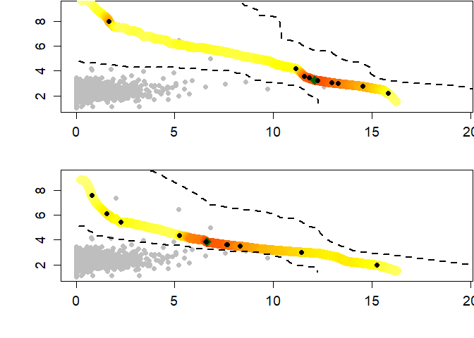<!-- -->

The first points on the median curve using the WT13 model are:

``` r
head(curve$median_wt13)
```

    ##    Rainfall     OsWL
    ## 1 0.2412900 8.852764
    ## 2 0.2575412 8.844170
    ## 3 0.2737923 8.835576
    ## 4 0.2900434 8.826982
    ## 5 0.3062946 8.818388
    ## 6 0.3225457 8.809794

and the corresponding elements of the upper and lower confident bounds
are:

``` r
head(curve$ub_wt13)
```

    ##       Rainfall     OsWL
    ## [1,] 0.5956325 20.35378
    ## [2,] 0.8837232 15.34917
    ## [3,] 1.2433189 14.43868
    ## [4,] 1.4267331 12.54313
    ## [5,] 1.6490047 11.64420
    ## [6,] 1.9147174 11.26396

``` r
head(curve$lb_wt13)
```

    ##       Rainfall     OsWL
    ## [1,] 0.1253444 5.089478
    ## [2,] 0.2509270 5.089478
    ## [3,] 0.3769878 5.089478
    ## [4,] 0.4994411 5.054515
    ## [5,] 0.5912159 4.829807
    ## [6,] 0.6863568 4.692816

Events estimated to possess a
-year
joint return period.

``` r
#"Most-likely" design event
curve$most_likely_wt13
```

    ##   Rainfall     OsWL
    ## 1 6.642097 3.823905

``` r
#Ensemble of ten design events 
curve$ensemble_wt13
```

    ##       Rainfall     OsWL
    ## 625  8.3058789 3.497887
    ## 943 15.2430490 1.977750
    ## 250  1.5405808 6.113077
    ## 597  7.6551572 3.608986
    ## 475  5.2458595 4.366458
    ## 758 11.4269801 3.022835
    ## 547  6.5834851 3.872280
    ## 596  7.6322458 3.613356
    ## 119  0.7893961 7.560068
    ## 319  2.2699819 5.425128

The `return_curve_diag()` function calculates the empirical probability
of observing data within the survival regions defined by a subset of
points on the return curve. If the curve is a good fit, the empirical
probabilities should closely match the probabilities associated with the
return level curve. The procedure which is introduced in
[Murphy-Barltrop et al. (2023)](https://doi.org/10.1002/env.2797) uses
bootstrap resampling of the original data set to obtain confidence
intervals for the empirical estimates. Since observations are required
in the survival regions to estimate the empirical probabilities, it is
recommended that this function be run for shorter return periods that
may usually be considered for design e.g., for a 1-year return period
rather than a 50-year return period. The inputs are almost identical to
those of the `return_curve_est` function. The only additional arguments
are `boot_method_all` which details the bootstrapping procedure - basic
or block - to use when estimating the distribution of empirical
(survival) probabilities from the original data set (without any
declustering), `boot_replace_all` which specifies whether to sample with
replacement in the case of a basic bootstrap and `block_length_all`
which specifies the block length for the block bootstrap.

``` r
#Diagnostic plots for the return curves
curve = return_curve_diag(data=S22.Detrend.df.extended[,1:3],
                          q=0.985,rp=1,mu=365.25,n_sim=100,
                          n_grad=50,n_boot=100,boot_method="monthly",
                          boot_replace=NA, block_length=NA, boot_prop=0.8,
                          decl_method_x="runs", decl_method_y="runs",
                          window_length_x=NA,window_length_y=NA,
                          u_x=0.95, u_y=0.95,
                          sep_crit_x=36, sep_crit_y=36,
                          alpha=0.1,
                          boot_method_all="block", boot_replace_all=NA,
                          block_length_all=14)
```

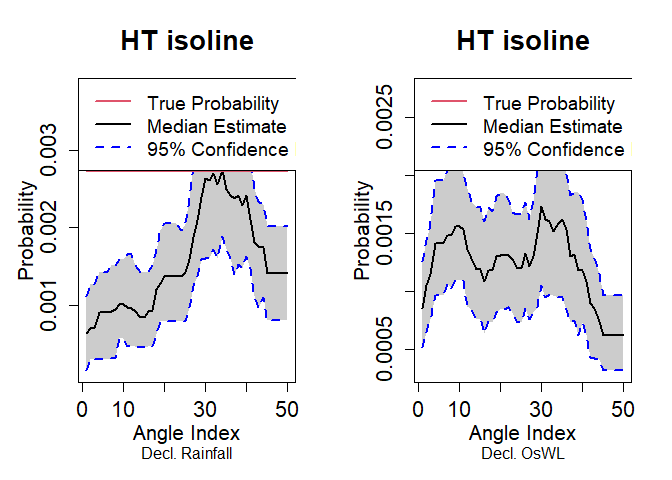<!-- -->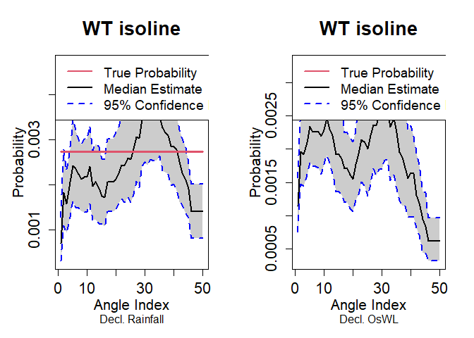<!-- -->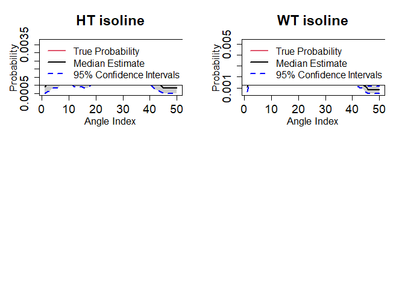<!-- -->

## 5. Trivariate analysis

The package contains three higher dimensional
")
approaches are implemented to model the joint distribution of rainfall,
O-sWL and groundwater level. They are:

- Standard (trivariate) copula
- Pair Copula Construction
- Heffernan and Tawn (2004)

#### Standard (trivariate) copula

In the package, each approach has a `_Fit` and `_Sim` function. The
latter requires a `MIGPD` object as its `Marginals` input argument, in
order for the simulations on

to be transformed back to the original scale. The `Migpd_Fit` command
fits independent GPDs to the data in each row of a dataframe (excluding
the first column if it is a “Date” object) creating a `MIGPD` object.

``` r
S20.Migpd<-Migpd_Fit(Data=S20.Detrend.Declustered.df[,-1],Data_Full = S20.Detrend.df[,-1],
                     mqu=c(0.975,0.975,0.9676))
summary(S20.Migpd)
```

    ## 
    ## A collection of 3 generalized Pareto models.
    ## All models converged.
    ## Penalty to the likelihood: gaussian
    ## 
    ## Summary of models:
    ##                   Rainfall      OsWL Groundwater
    ## Threshold        1.6000000 1.9385406   2.8599327
    ## P(X < threshold) 0.9750000 0.9750000   0.9676000
    ## sigma            0.9040271 0.1574806   0.3083846
    ## xi               0.1742220 0.2309118  -0.3441421
    ## Upper end point        Inf       Inf   3.7560295

Standard (trivariate) copula are the most conceptually simple of the
copula based models, using a single parametric multivariate probability
distribution as the copula. The `Standard_Copula_Fit()` function fits
elliptic (specified by `Gaussian` or `tcop`) or Archimedean (specified
by `Gumbel`,`Clayton` or `Frank`) copula to a trivariate dataset. Let
first fit a Gaussian copula

``` r
S20.Gaussian<-Standard_Copula_Fit(Data=S20.Detrend.df,Copula_Type="Gaussian")
```

From which the `Standard_Copula_Sim()` function can be used to simulate
a synthetic record of N years

``` r
S20.Gaussian.Sim<-Standard_Copula_Sim(Data=S20.Detrend.df,Marginals=S20.Migpd,
                                      Copula=S20.Gaussian,N=100)
```

Plotting the observed and simulated values

``` r
S20.Pairs.Plot.Data<-data.frame(rbind(na.omit(S20.Detrend.df[,-1]),S20.Gaussian.Sim$x.Sim),
                                c(rep("Observation",nrow(na.omit(S20.Detrend.df))),
                                  rep("Simulation",nrow(S20.Gaussian.Sim$x.Sim))))
colnames(S20.Pairs.Plot.Data)<-c(names(S20.Detrend.df)[-1],"Type")
pairs(S20.Pairs.Plot.Data[,1:3],
      col=ifelse(S20.Pairs.Plot.Data$Type=="Observation","Black",alpha("Red",0.3)),
      upper.panel=NULL,pch=16)
```

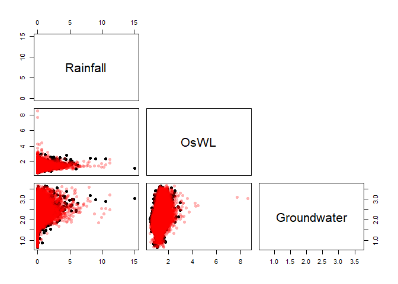<!-- -->

The `Standard_Copula_Sel()` function can be used to deduce the best
fitting in terms of AIC

``` r
Standard_Copula_Sel(Data=S20.Detrend.df)
```

    ##     Copula        AIC
    ## 1 Gaussian -1389.1438
    ## 2    t-cop -1434.7850
    ## 3   Gumbel  -876.7537
    ## 4  Clayton  -565.7595
    ## 5    Frank  -854.4284

#### Pair Copula Construction

Standard trivariate copulas lack flexibility to model joint
distributions where heterogeneous dependencies exist between the
variable pairs. Pair copula constructions construct multivariate
distribution using a cascade of bivariate copulas (some of which are
conditional). As the dimensionality of the problem increases the number
of mathematically equally valid decompositions quickly becomes large.
Bedford and Cooke (2001,2002) introduced the regular vine, a graphical
model which helps to organize the possible decompositions. The Canonical
(C-) and D- vine are two commonly utilized sub-categories of regular
vines, in the trivariate case a vine copula is simultaneously a C- and
D-vine. Let’s fit a regular vine copula model

``` r
S20.Vine<-Vine_Copula_Fit(Data=S20.Detrend.df)
```

From which the `Vine_Copula_Sim()` function can be used to simulate a
synthetic record of N years

``` r
S20.Vine.Sim<-Vine_Copula_Sim(Data=S20.Detrend.df,Vine_Model=S20.Vine,Marginals=S20.Migpd,N=100)
```

Plotting the observed and simulated values

``` r
S20.Pairs.Plot.Data<-data.frame(rbind(na.omit(S20.Detrend.df[,-1]),S20.Vine.Sim$x.Sim),
                                c(rep("Observation",nrow(na.omit(S20.Detrend.df))),
                                  rep("Simulation",nrow(S20.Vine.Sim$x.Sim))))
colnames(S20.Pairs.Plot.Data)<-c(names(S20.Detrend.df)[-1],"Type")
pairs(S20.Pairs.Plot.Data[,1:3],
      col=ifelse(S20.Pairs.Plot.Data$Type=="Observation","Black",alpha("Red",0.3)),
      upper.panel=NULL,pch=16)
```

<!-- -->

#### HT04

Finally, let us implement the Heffernan and Tawn (2004) approach, in
which a non-linear regression model is fitted to joint observations
where a conditioning variable exceeds a specified threshold. The
regression model typically adopted is:

where:


is a set of variables transformed to a common scale

is the set of variables excluding


and

are vectors of regression parameters

is a vector of residuals

The dependence structure when a specified variable is extreme is thus
captured by the regression parameters and the joint residuals. The
procedure is repeated, conditioning on each variable in turn, to build
up the joint distribution when at least one variable is in an extreme
state. The HT04 command fits the model and simulates N years’ worth of
data from the fitted model.

``` r
S20.HT04<-HT04(data_Detrend_Dependence_df=S20.Detrend.df,
               data_Detrend_Declustered_df=S20.Detrend.Declustered.df,
               u_Dependence=0.995,Migpd=S20.Migpd,mu=365.25,N=1000)
```

Output of the function includes the three conditional `Models`,
proportion of occasions where each variable is most extreme given at
least one variable is extreme `prop`as well as, the simulations on the
transformed scale `u.Sim` (Gumbel by default) and original scale
`x.Sim`. Let’s view the fitted model when conditioning on rainfall

``` r
S20.HT04$Model$Rainfall
```

    ## mexDependence(x = Migpd, which = colnames(data_Detrend_Dependence_df)[i], 
    ##     dqu = u_Dependence, margins = "laplace", constrain = FALSE, 
    ##     v = V, maxit = Maxit)
    ## 
    ## 
    ## Marginal models:
    ## 
    ## Dependence model:
    ## 
    ## Conditioning on Rainfall variable.
    ## Thresholding quantiles for transformed data: dqu = 0.995
    ## Using laplace margins for dependence estimation.
    ## Log-likelihood = -108.5807 -84.53349 
    ## 
    ## Dependence structure parameter estimates:
    ##     OsWL Groundwater
    ## a 1.0000      0.3295
    ## b 0.6948     -1.5240

``` r
S20.HT04$Prop
```

    ## [1] 0.3552632 0.3157895 0.3289474

and the which the proporiton of the occasions in the original sample
that rainfall is the most extreme of the drivers given that at least one
driver is extreme.

The HT04 approach uses rejection sampling to generate synthetic records.
The first step involves sampling a variable, conditioned to exceed the
`u_Dependence` threshold. A joint residual associated with the
corresponding regression is independently sampled and other variables
estimated using the fitted regression parameters. If the variable
conditioned to be extreme in step one is not the most extreme the sample
is rejected. The process is repeated until the relative proportion of
simulated events where each variable is a maximum, conditional on being
above the threshold, is consistent with the empirical distribution.
Labeling the simulations `S20.HT04.Sim`

``` r
S20.HT04.Sim<-S20.HT04$x.sim
```

and now plotting the simulations from the HT04 model

``` r
S20.Pairs.Plot.Data<-data.frame(rbind(na.omit(S20.Detrend.df[,-1]),S20.HT04.Sim),
                                c(rep("Observation",nrow(na.omit(S20.Detrend.df))),
                                  rep("Simulation",nrow(S20.HT04.Sim))))
colnames(S20.Pairs.Plot.Data)<-c(names(S20.Detrend.df)[-1],"Type")
pairs(S20.Pairs.Plot.Data[,1:3],
      col=ifelse(S20.Pairs.Plot.Data$Type=="Observation","Black",alpha("Red",0.2)),
      upper.panel=NULL,pch=16)
```

<!-- -->

## 6. Sea Level Rise

The `SLR_Scenarios` function estimates the time required for a
user-specified amount of sea level rise ( `SeaLevelRise`) to occur under
various sea level rise scenarios. The default scenarios are for Key West
from the Southeast Florida Regional Climate Change Compact (2019). Let’s
calculate how long before the O-sWL in the 100-year “most-likely” design
event (see section 4) equals that of the corresponding design event
derived under full dependence.

``` r
#Difference in O-sWL between the most-likely and full dependence events
Diff<-S20.Bivariate$FullDependence$`100`$OsWL-S20.Bivariate$MostLikelyEvent$`100`$OsWL
Diff
```

    ## [1] 0.1355031

``` r
#Time in years for the sea level rise to occur
SLR_Scenarios(SeaLevelRise=Diff,Unit="m")
```

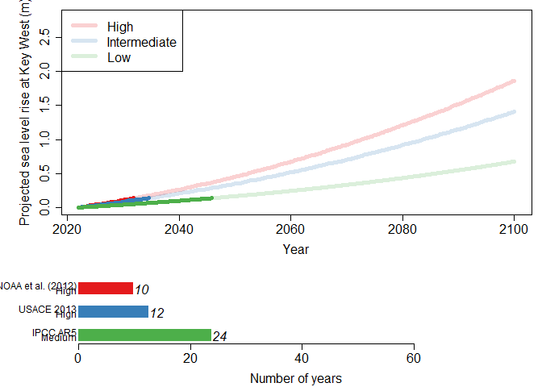<!-- -->

    ## $High
    ## [1] 2032
    ## 
    ## $Intermediate
    ## [1] 2034
    ## 
    ## $Low
    ## [1] 2046

Scenarios from the Interagency Sea Level Rise Scenario Tool (2022) for
Miami Beach and Naples can be utilized by changing the `Scenario` and
`Location` arguments. Alternatively, a user can input other sea level
rise scenarios into the function. For example, below we use the
scenarios from the same tool but for Fort Myers.

``` r
SeaLevelRise.2022<-read.csv("F:/OneDrive - University of Central Florida/Documents/sl_taskforce_scenarios_psmsl_id_1106_Fort_Myers.csv")
SeaLevelRise.2022_input<-data.frame(Year=seq(2020,2150,10),
"High"=as.numeric(SeaLevelRise.2022[14,-(1:5)])/1000,
"Int_Medium"=as.numeric(SeaLevelRise.2022[11,-(1:5)])/1000,
"Medium"=as.numeric(SeaLevelRise.2022[8,-(1:5)])/1000,
"Int_Low"=as.numeric(SeaLevelRise.2022[5,-(1:5)])/1000,
"Low"=as.numeric(SeaLevelRise.2022[2,-(1:5)])/1000)
SLR_Scenarios(SeaLevelRise=0.8, Scenario="Other", Unit = "m", Year=2022, 
              Location="Fort Myers", New_Scenario=SeaLevelRise.2022_input)
```

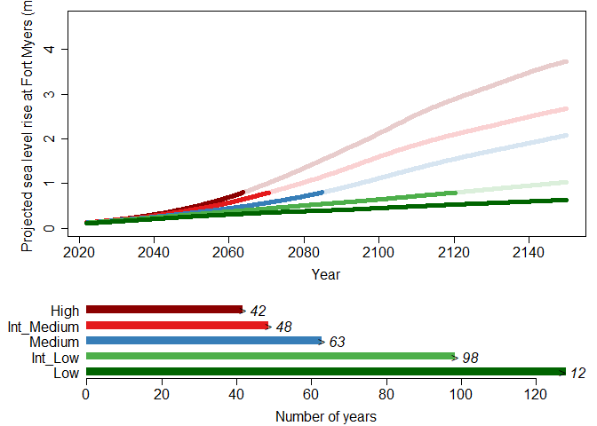<!-- -->

    ## $SLR_Year
    ## [1] 2150 2120 2085 2070 2064

## 7. Simulating temporally varying events

By sampling peaks from a multivariate statistical model e.g., a vine
copula that includes the relative lag between the rainfall and water
level peaks as well as their magnitudes temporally-varying synthetic
events can be simulated.

#### Water level curves

The intensity of a storm surge event is defined in [Wahl et
al. 2011](https://doi.org/10.5194/nhess-11-2925-2011) as the area of the
water level curve above a specified base line level from the first low
water level of the preceding tide and last low tide of the following
tide. The `intensity()` function calculates this metric with the default
baseline level set as the mean of the water level time series
(`Base_Line`=`"Mean "`). Let’s calculate the “intensity” of cluster
maxima in the hourly O-sWL time series at control structure S-13.

``` r
#Decluster O-sWL series at S-13 using a runs method
S13.OsWL.Declust = Decluster(Data=S13.Detrend.df$OsWL,
                            SepCrit=24*7, u=0.99667)
#Calculate O-sWL of the identified cluster maximum
intensity = Intensity(Data=S13.Detrend.df[,c(1,3)],
                      Cluster_Max=S13.OsWL.Declust$EventsMax,
                      Base_Line=2)
```

Plotting a subset of the events:

``` r
#Plotting water levels
#Converting Date_Time column to POSIXct class
S13.Detrend.df$Date_Time <- as.POSIXct(S13.Detrend.df$Date_Time, 
                                         format = "%Y-%m-%d %H:%M:%S")
plot(S13.Detrend.df$Date_Time[(S13.OsWL.Declust$EventsMax[1]-48):(S13.OsWL.Declust$EventsMax[1]+48)], 
     S13.Detrend.df$OsWL[(S13.OsWL.Declust$EventsMax[1]-48):(S13.OsWL.Declust$EventsMax[1]+48)],
     xlab="Time", ylab="O-sWL (ft NGVD 29)",type='l',lwd=1.5)

#Adding purple points denoting preceding and following high tides
points(S13.Detrend.df$Date_Time[intensity$Pre.High[1]], 
     S13.Detrend.df$OsWL[intensity$Pre.High[1]],pch=16,cex=1.5,col="Purple")
points(S13.Detrend.df$Date_Time[intensity$Fol.High[1]], 
       S13.Detrend.df$OsWL[intensity$Fol.High[1]],pch=16,cex=1.5,col="Purple")

#Adding orange points denoting preceding and following low tides
points(S13.Detrend.df$Date_Time[intensity$Pre.Low[1]], 
       S13.Detrend.df$OsWL[intensity$Pre.Low[1]],pch=16,cex=1.5,col="Orange")
points(S13.Detrend.df$Date_Time[intensity$Fol.Low[1]], 
       S13.Detrend.df$OsWL[intensity$Fol.Low[1]],pch=16,cex=1.5,col="Orange")

#Recall BaseLine=2
baseline= 2

# Only create polygon showing intensity
above<- S13.Detrend.df$OsWL[intensity$Pre.Low[1]:intensity$Fol.Low[1]] > baseline

if(any(above)) {
  runs <- rle(above)
  ends <- cumsum(runs$lengths)
  starts <- c(1, ends[-length(ends)] + 1)
  
  for(j in which(runs$values)) {
    start_idx <- starts[j]
    end_idx <- ends[j]
    
    x_seg <- S13.Detrend.df$Date_Time[intensity$Pre.Low[1]:intensity$Fol.Low[1]][start_idx:end_idx]
    y_seg <- S13.Detrend.df$OsWL[intensity$Pre.Low[1]:intensity$Fol.Low[1]][start_idx:end_idx]
    
    polygon(x = c(x_seg, rev(x_seg)),
            y = c(y_seg, rep(baseline, length(x_seg))), 
            col = "dark grey", border = NA)
  }
}
```

<!-- -->

The `WL_Curve()` function generates a water level curve conditioned on a
water level event peak (`Peak`) and “intensity” (`Intensity`). The
function works by re-scaling observed events curves between four time
units before and after the peak such that the re-scaled peak coincides
with conditioned peak. It then computes the intensity of the re-scaled
events and selects the event with the highest intensity that’s less than
conditioned intensity. Intensity units are then added to ensure the
intensity of the simulated curve matches the conditioned intensity. The
Intensity units, which manifest as increases in water level, are
distributed in proportion with the decreases of water levels from the
peak OsWL i.e., more units are added at lower water levels. No units are
added about the peak. For conditioned event peaks below a user-specified
threshold (`Thres`) an observed curve with an intensity less than some
user-specified limit (`Limit`) is randomly sampled.

``` r
#Four synthetic events all with intensity of 60 units
sim.peaks = c(3.4,4,4.2,5)
sim.intensity = c(60,60,60,60)

#Generating the water level curves
oswl_ts_oswl = WL_Curve(Data = S13.Detrend.df,
                        Cluster_Max = S13.OsWL.Declust$EventsMax,
                        Pre_Low = intensity$Pre.Low,
                        Fol_Low = intensity$Fol.Low,
                        Thres = S13.OsWL.Declust$Threshold, Limit = 45,
                        Peak = sim.peaks,
                        Base_Line=2,
                        Intensity = sim.intensity)
```

Superimposing the four simulated water level curves on the observed
curves:

``` r
#Plot the water level curves of the observed peaks
plot(1:289,
     S13.Detrend.df$OsWL[(S13.OsWL.Declust$EventsMax[1]-144):
                         (S13.OsWL.Declust$EventsMax[1]+144)],
     type='l',ylim=c(-2,6))
for(i in 2:length(S13.OsWL.Declust$EventsMax)){
  lines(1:289,
        S13.Detrend.df$OsWL[(S13.OsWL.Declust$EventsMax[i]-144):
                            (S13.OsWL.Declust$EventsMax[i]+144)])
}
#Superimpose the curves generated for the four synthetic events
for(i in 1:4){
  lines(1:289,oswl_ts_oswl$Series[i,],col=2)
}
```

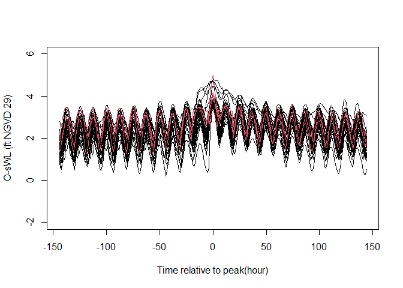<!-- -->

#### Hyetographs

[Serinaldi and Kilsby](https://doi.org/10.1002/wrcr.20221) studied the
pairwise relationships between key hyetograph characteristics: maximum
value
,
volume
,
duration
,
and average intensity

at

rain gauge stations in central eastern Europe with daily rainfall
records and three 5-minutes record gauges in Italy. The authors found
that at both temporal scales the only stochastic relationship was
between volume and duration, and that simple bootstrap procedures could
be used to generate events that preserve the pairwise relationships
among the characteristics. The `U_Sample` function implements a
bootstrap procedure referred to as the U-boot algorithm in [Serinaldi
and Kilsby (2013)](https://doi.org/10.1002/wrcr.20221) to generate
hyetograhs. For a simulated peak `Xp`, a duration is independently
sampled and a set of non-peaks are sampled at random from one of the
events with the same duration. To implement the method exactly as in
[Serinaldi and Kilsby (2013)](https://doi.org/10.1002/wrcr.20221), set
`Xp` equal to a sample (taken with replacement) of the observed cluster
maximum (peaks). An example application of the function is given below
for rainfall recorded at control structure S-13. First the hourly time
series is declustered to find the characteristics of the rainfall events
containing the

highest peaks:

``` r
#First decluster the rainfall series to find the 500 events
#with the highest peaks
S13.Rainfall.Declust = Decluster(Data=S13.Detrend.df$Rainfall,
                                 SepCrit=24*3, u=0.99667)
#Hourly peaks
peaks = S13.Detrend.df$Rainfall[S13.Rainfall.Declust$EventsMax]
#Set very small rainfall measurements to zero.
#Assumed to be the result of uncertainty in measuring equipment.
S13.Detrend.df$Rainfall[which(S13.Detrend.df$Rainfall<0.01)] = 0
#Find NAs in rainfall series
z = which(is.na(S13.Detrend.df$Rainfall)==T)
#Temporarily set NAs to zero
S13.Detrend.df$Rainfall[z] = 0
#Find times where there is 6-hours of no rainfall
no.rain = rep(NA,length(S13.Detrend.df$Rainfall))
for(i in 6:length(S13.Detrend.df$Rainfall)){
  no.rain[i] = ifelse(sum(S13.Detrend.df$Rainfall[(i-5):i])==0,i,NA)
}
#Remove NAs from results vector as these correspond to times where there is
#rainfall at certain points in the 6 hour period.
no.rain = na.omit(no.rain)
#Reset missing values in the rainfall record back to NA
S13.Detrend.df$Rainfall[z] = NA
#Find the start and end times of the 500 events.
start = rep(NA,length(S13.Rainfall.Declust$EventsMax))
end = rep(NA,length(S13.Rainfall.Declust$EventsMax))
for(i in 1:length(S13.Rainfall.Declust$EventsMax)){
 start[i] = max(no.rain[which(no.rain<S13.Rainfall.Declust$EventsMax[i])])
 end[i] = min(no.rain[which(no.rain>S13.Rainfall.Declust$EventsMax[i])])
}
start = start + 1
end = end - 6
d = end - start + 1 #Duration
#Simulate some peaks by sampling observed peaks with replacement
#I.e., applying the method exactly as in Serinaldi and Kilsby (2013)
sim.peak = sample(peaks,size=500,replace=TRUE)
```

Now the bootstrapping procedure can be carried out:

``` r
sample = U_Sample(Data=S13.Detrend.df$Rainfall,
                  Cluster_Max=S13.Rainfall.Declust$EventsMax,
                  D=d,Start=start,End=end,
                  Xp=sim.peak)
```

Let’s check whether the characteristic of the bootstrapped events match
those of the observed events. First, calculating the volume and
intensity of the

observed events with the highest hourly peaks.

``` r
#Calculating volume and intensity
v<-rep(NA,500)
for(i in 1:length(S13.Rainfall.Declust$EventsMax)){
  v[i] = sum(S13.Detrend.df$Rainfall[(start[i]):(end[i])])
}
I = v/d

#Putting in a data.frame
observations = data.frame(peaks,d,v,I)
colnames(observations) = c("peak","d","v","I")
```

To aid the comparison information relating to the marginal distributions
of the characteristics is removed by transforming the data to the
![\[0,1\]^2](https://latex.codecogs.com/png.image?%5Cdpi%7B110%7D&space;%5Cbg_white&space;%5B0%2C1%5D%5E2 "[0,1]^2")
scale.

``` r
#Observations
observations.u = data.frame(pobs(observations))
colnames(observations.u) = c("peak","d","v","I")

#Sample
sample.u = data.frame(pobs(sample))
```

Scatter plots showing the pairwise relationships of the characteristics:

``` r
#Layout of the plots
par(mfrow=c(4,6))
par(mar=c(4.2,4.2,0.1,0.1))

#Characteristics of observations on original scale
plot(observations$peak,observations$I,pch=16,xlab="",ylab="",cex.axis=1.25)
mtext(expression('X'[p]),side=1,line=3)
mtext("I",side=2,line=2.3)
plot(observations$peak,observations$v,pch=16,xlab="",ylab="",cex.axis=1.25)
mtext(expression('X'[p]),side=1,line=3)
mtext("V",side=2,line=2.3)
plot(observations$peak,observations$d,pch=16,xlab="",ylab="",cex.axis=1.25)
mtext(expression('X'[p]),side=1,line=3)
mtext("D",side=2,line=2.3)
plot(observations$I,observations$v,pch=16,xlab="",ylab="",cex.axis=1.25)
mtext("I",side=1,line=2.5)
mtext("V",side=2,line=2.3)
plot(observations$I,observations$d,pch=16,xlab="",ylab="",cex.axis=1.25)
mtext("I",side=1,line=2.5)
mtext("D",side=2,line=2.3)
plot(observations$v,observations$d,pch=16,xlab="",ylab="",cex.axis=1.25)
mtext("V",side=1,line=2.5)
mtext("D",side=2,line=2.3)

#Characteristics of sample on original scale
plot(sample$Xp,sample$I,pch=16,xlab="",ylab="",cex.axis=1.25,col=2)
mtext(expression('X'[p]),side=1,line=3)
mtext('I',side=2,line=2.3)
plot(sample$Xp,sample$V,pch=16,xlab="",ylab="",cex.axis=1.25,col=2)
mtext(expression('X'[p]),side=1,line=3)
mtext('V',side=2,line=2.3)
plot(sample$Xp,sample$D,pch=16,xlab="",ylab="",cex.axis=1.25,col=2)
mtext(expression('X'[p]),side=1,line=3)
mtext("D",side=2,line=2.3)
plot(sample$I,sample$V,pch=16,xlab="",ylab="",cex.axis=1.25,col=2)
mtext('I',side=1,line=2.5)
mtext('V',side=2,line=2.3)
plot(sample$I,sample$D,pch=16,xlab="",ylab="",cex.axis=1.25,col=2)
mtext('I',side=1,line=2.5)
mtext("D",side=2,line=2.3)
plot(sample$V,sample$D,pch=16,xlab="",ylab="",cex.axis=1.25,col=2)
mtext('V',side=1,line=2.5)
mtext("D",side=2,line=2.3)

#Characteristics of observations on the [0,1] scale
plot(observations.u$peak,observations.u$I,pch=16,xlab="",ylab="",cex.axis=1.25)
mtext(expression('X'[p]),side=1,line=3)
mtext('I',side=2,line=2.3)
plot(observations.u$peak,observations.u$v,pch=16,xlab="",ylab="",cex.axis=1.25)
mtext(expression('X'[p]),side=1,line=3)
mtext('V',side=2,line=2.3)
plot(observations.u$peak,observations.u$d,pch=16,xlab="",ylab="",cex.axis=1.25)
mtext(expression('X'[p]),side=1,line=3)
mtext('D',side=2,line=2.3)
plot(observations.u$I,observations.u$v,pch=16,xlab="",ylab="",cex.axis=1.25)
mtext('I',side=1,line=2.5)
mtext('V',side=2,line=2.3)
plot(observations.u$I,observations.u$d,pch=16,xlab="",ylab="",cex.axis=1.25)
mtext('I',side=1,line=2.5)
mtext('D',side=2,line=2.3)
plot(observations.u$v,observations.u$d,pch=16,xlab="",ylab="",cex.axis=1.25)
mtext('V',side=1,line=2.5)
mtext('D',side=2,line=2.3)

#Characteristics of sample on the [0,1] scale
plot(sample.u$Xp,sample.u$I,pch=16,xlab="",ylab="",cex.axis=1.25,col=2)
mtext(expression('X'[p]),side=1,line=3)
mtext('I',side=2,line=2.3)
plot(sample.u$Xp,sample.u$V,pch=16,xlab="",ylab="",cex.axis=1.25,col=2)
mtext(expression('X'[p]),side=1,line=3)
mtext('V',side=2,line=2.3)
plot(sample.u$Xp,sample.u$D,pch=16,xlab="",ylab="",cex.axis=1.25,col=2)
mtext(expression('X'[p]),side=1,line=3)
mtext("D",side=2,line=2.3)
plot(sample.u$I,sample.u$V,pch=16,xlab="",ylab="",cex.axis=1.25,col=2)
mtext('I',side=1,line=2.5)
mtext('V',side=2,line=2.3)
plot(sample.u$I,sample.u$D,pch=16,xlab="",ylab="",cex.axis=1.25,col=2)
mtext('I',side=1,line=2.5)
mtext("D",side=2,line=2.3)
plot(sample.u$V,sample.u$D,pch=16,xlab="",ylab="",cex.axis=1.25,col=2)
mtext('V',side=1,line=2.5)
mtext("D",side=2,line=2.3)
```

<!-- -->

The figure demonstrates that the simulated events preserves the key
characteristics of the observed events.

